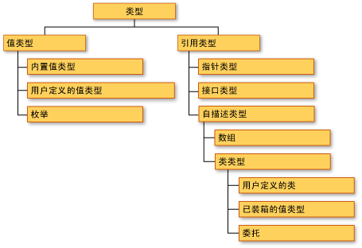
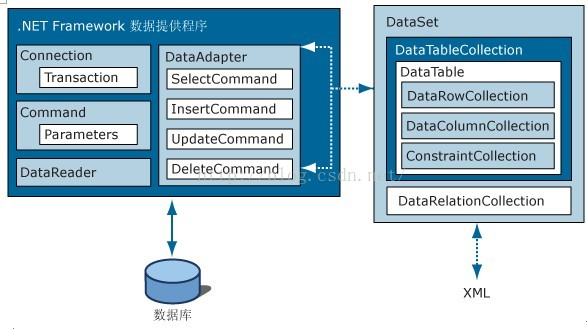

访问博客[C#/.NET Web 部分复习总结（面试常问）](https://ns96.com/2018/01/19/Csharp-knowledgere/) 带目录模式查看！

# **C#**

## 值类型和引用类型的区别?
在C#中值类型的变量直接存储数据，而引用类型的变量持有的是数据的引用，数据存储在数据堆中。


>值类型（value type）：byte，short，int，long，float，double，decimal，char，bool 和 struct 统称为值类型。值类型变量声明后，不管是否已经赋值，编译器为其分配内存。  

>引用类型（reference type）：string 和 class统称为引用类型。当声明一个类时，只在栈中分配一小片内存用于容纳一个地址，而此时并没有为其分配堆上的内存空间。当使用 new 创建一个类的实例时，分配堆上的空间，并把堆上空间的地址保存到栈上分配的小片空间中。  


值类型的实例通常是在线程栈上分配的（静态分配），但是在某些情形下可以存储在堆中。引用类型的对象总是在进程堆中分配（动态分配）。  


**总结一句话**：c#的值类型是为变量在栈上分配了一块内存，用于存储数据，而引用类型分为两部分，声明时只在栈上分配了一小部分内存，堆上没分配，而new引用变量时，是在堆上分配了一块内存，存储的是栈上的内存地址，注意：struct是值类型，string和class是引用类型，string不需要new是因为想要语义化“字符串”,省略创建过程。  




## 什么是装箱和拆箱？
装箱（boxing）和拆箱（unboxing）是C#类型系统的核心概念.是不同于C与C++的新概念！,通过装箱和拆箱操作，能够在值类型和引用类型中架起一做桥梁.换言之,可以轻松的实现值类型与引用类型的互相转换,装箱和拆箱能够统一考察系统,任何类型的值最终都可以按照对象进行处理.

装箱就是隐式的将一个值型转换为引用型对象。比如：
```cs
int i=0;
Syste.Object obj=i;
```
这个过程就是装箱！就是将i装箱！

拆箱就是将一个引用型对象转换成任意值型！比如：
```cs
int i=0;
System.Object obj=i;
int j=(int)obj;
```
这个过程前2句是将i装箱，后一句是将obj拆箱！

```cs
int i=0;
System.Object obj=i;
Console.WriteLine(i+","+(int)obj);
```
上述代码共发生了3次装箱和一次拆箱！

## C# 递归是什么？
在数学与计算机科学中，递归是指在函数的定义中使用函数自身的方法。

递归算法是一种直接或者间接地调用自身算法的过程。在计算机编写程序中，递归算法对解决一大类问题是十分有效的，它往往使算法的描述简洁而且易于理解。

递归算法解决问题的特点：
-  递归就是在过程或函数里调用自身。
- 在使用递归策略时，必须有一个明确的递归结束条件，称为递归出口。
- 递归算法解题通常显得很简洁，但递归算法解题的运行效率较低。所以一般不提倡用递归算法设计程序。
- 在递归调用的过程当中系统为每一层的返回点、局部量等开辟了栈来存储。递归次数过多容易造成栈溢出等。所以一般不提倡用递归算法设计程序。在实际编程中尤其要注意栈溢出问题。


借助递归方法，我们可以把一个相对复杂的问题转化为一个与原问题相似的规模较小的问题来求解，递归方法只需少量的程序就可描述出解题过程所需要的多次重复计算，大大地减少了程序的代码量。但在带来便捷的同时，也会有一些缺点，也即：通常用递归方法的运行效率不高。

**简言之：** 递归就是一个可以自我调用的函数或则方法。

---

**以Fibonacci数列和阶乘为例：**

## Fibonacci
>斐波那契数列就是如下的数列：0, 1, 1, 2, 3, 5, 8, 13, 21, 34, 55, 89, 144, …
总之，就是第N(N > 2)个数等于第(N - 1)个数和(N - 2)个数的和。

```cs
public static int Fibonacci(int n)
{
    if (n < 0) return -1;
    if (n == 0) return 0;
    if (n == 1) return 1;
    return Fibonacci(n - 1) + Fibonacci(n - 2);
}
```

## 阶乘
>阶乘公式： n!=1×2×3×...×n

```cs
public static int Factorial(int n)
{
    int sum = 0;
    if(0 == n)
        return 1;
    else
        sum = n * Factorial(n -1);
    return sum;
}
```

## 泛型

## 委托
先说下什么是委托，顾名思义，就是自己不完成，让别人帮你完成！

换成大白话：我遇到了一个问题，我不知道怎么解决，但是我接下来要做的事情需要这个问题的结果作为前提，我就去找一个人来帮我得出结论，岂不美哉。

在C#中，委托的作用是这样描述的：委托就像一个函数的指针，在程序运行时可以使用它们来调用不同的函数。

### 简单的委托

那委托需要承载哪些信息呢？

首先，它存储了方法名，还有参数列表(方法签名),以及返回的类型。比如：

```
delegate string/*返回类型*/ ProcessDelegate(int i);
```

这就是一个委托的定义。`delegate` 是声明委托的关键字，`string` 是返回的类型，而`ProcessDelegate(int i)`是委托的类型名，和一个类名差不多，而`()`里的就是参数部分。

翻译一下，你要使用这个委托来做事情的话，那么，做事情的方法必须满足以下条件：

1. 返回类型和委托的返回类型一致，这里是string类型；
2. 能且只能有一个参数，并且是int类型。

示例：
```cs
using System;
using System.Collections.Generic;
using System.Text;
 
namespace TestApp
{
    public delegate string ProcessDelegate(string s1, string s2);

    class Program
    {
        static void Main(string[] args)
        {
            /*  调用方法  */
           ProcessDelegate pd = new ProcessDelegate(new Test().Process);
           Console.WriteLine(pd("Text1", "Text2"));
        }
    }
 
    public class Test
    {
        public string Process(string s1,string s2)
        {
             return s1 + s2;
        }
    }
}
```

>输出的结果是: Text1Tex2

### 泛型委托
将上面的简单委托修改为泛型委托
```cs
using System;
using System.Collections.Generic;
using System.Text;
 
namespace TestApp
{
    public delegate string ProcessDelegate<T,S>(T s1, S s2);

    class Program
    {
        static void Main(string[] args)
        {
            /*  调用方法  */
           ProcessDelegate pd = new ProcessDelegate<string,int>(new Test().Process);
           Console.WriteLine(pd("Text1", "666"));
        }
    }
 
    public class Test
    {
        public string Process(string s1,string s2)
        {
             return s1 + s2;
        }
    }
}
```
输出的结果就是：
Text666

## 事件
在某件事情发生时，一个对象可以通过事件通知另一个对象。

在C#中，时间定义关键字是event。
例如：
```cs
event ProcessDelegate ProcessEvent;
```

整个事件定义方法以及执行过程：
```cs
using System;
using System.Collections.Generic;
using System.Text;

namespace TestApp
{
    /// <summary>
    /// 委托
    /// </summary>
    /// <param name="s1"></param>
    /// <param name="s2"></param>
    /// <returns></returns>
    public delegate void ProcessDelegate(object sender, EventArgs e);

    class Program
    {
        

        static void Main(string[] args)
        {
            /*  第一步执行  */
            Test t = new Test();
            /* 关联事件方法，相当于寻找到了委托人 */
            t.ProcessEvent += new ProcessDelegate(t_ProcessEvent);
            /* 进入Process方法 */
            Console.WriteLine(t.Process()); 

            Console.Read();
        }

        static void t_ProcessEvent(object sender, EventArgs e)
        {
            Test t = (Test)sender;
            t.Text1 = "Hello";
            t.Text2 = "World";
        }
    }

    public class Test
    {
        private string s1;

        public string Text1
        {
            get { return s1; }
            set { s1 = value; }
        }

        private string s2;

        public string Text2
        {
            get { return s2; }
            set { s2 = value; }
        }


        public event ProcessDelegate ProcessEvent;

        void ProcessAction(object sender, EventArgs e)
        {
            if (ProcessEvent == null)
                ProcessEvent += new ProcessDelegate(t_ProcessEvent);
            ProcessEvent(sender, e);
        }

        //如果没有自己指定关联方法，将会调用该方法抛出错误
        void t_ProcessEvent(object sender, EventArgs e)
        {
            throw new Exception("The method or operation is not implemented.");
        }

        void OnProcess()
        {
            ProcessAction(this, EventArgs.Empty);
        }

        public string Process()
        {
            OnProcess();
            return s1 + s2;
        }
    }
}
```
相当于是可以用任意符合委托接口(委托确实很像接口)的代码，注入到Process过程。在他返回之前给他赋值。

## 回调函数
回调函数就是把一个方法的传给另外一个方法去执行。在C#有很多回调函数，比如异步操作的时候。
这里先举个例子：
```cs
using System;
using System.Collections.Generic;
using System.Text;

namespace TestApp
{
    /// <summary>
    /// 委托
    /// </summary>
    /// <param name="s1"></param>
    /// <param name="s2"></param>
    /// <returns></returns>
    public delegate string ProcessDelegate(string s1, string s2);

    class Program
    {
        static void Main(string[] args)
        {
            /*  调用方法  */
            Test t = new Test();
            string r1 = t.Process("Text1", "Text2", new ProcessDelegate(t.Process1));
            string r2 = t.Process("Text1", "Text2", new ProcessDelegate(t.Process2));
            string r3 = t.Process("Text1", "Text2", new ProcessDelegate(t.Process3));

            Console.WriteLine(r1);
            Console.WriteLine(r2);
            Console.WriteLine(r3);
        }
    }

    public class Test
    {
        public string Process(string s1,string s2,ProcessDelegate process)
        {
            return process(s1, s2);
        }

        public string Process1(string s1, string s2)
        {
            return s1 + s2;
        }

        public string Process2(string s1, string s2)
        {
            return s1 + Environment.NewLine + s2;
        }

        public string Process3(string s1, string s2)
        {
            return s2 + s1;
        }
    }
}
```
输出结果：
Text1Text2
Text1
Text2
Text2Text1

Process方法调用了一个回调函数，当然这里只执行了回调函数。可以看出，可以把任意一个符合这个委托的方法传递进去，意思就是说这部分代码是可变的。而设计上有一个抽离出可变部分代码的原则，这种用法无疑可以用到那种场合了。


## 匿名函数
匿名函数是一个“内联”语句或表达式，可在需要委托类型的任何地方使用。 可以使用匿名函数来初始化命名委托，或传递命名委托（而不是命名委托类型）作为方法参数。

C# 中的匿名函数包括，Lambda表达式和匿名方法两种用法：

### Lambda 表达式
Lambda 表达式是一种可用于创建 委托 或 表达式目录树 类型的 匿名函数 。 通过使用 lambda 表达式，可以写入可作为参数传递或作为函数调用值返回的本地函数。 Lambda 表达式对于编写 LINQ 查询表达式特别有用。

实例： 
```cs
delegate int del(int i);  
static void Main(string[] args)  
{  
    del myDelegate = x => x * x;  
    int j = myDelegate(5); //j = 25  
}  
```
Lambda 表达式更多用法参照 [MSDN-Lambda表达式](https://docs.microsoft.com/zh-cn/dotnet/csharp/programming-guide/statements-expressions-operators/lambda-expressions)

### 匿名方法
创建匿名方法实际上是一种将代码块作为委托参数传递的方式。在 C# 3.0 及更高版本中，Lambda 表达式取代匿名方法作为编写内联代码的首选方式。

实例：
```cs
// Create a handler for a click event.
button1.Click += delegate(System.Object o, System.EventArgs e)
                   { System.Windows.Forms.MessageBox.Show("Click!"); };

// Create a delegate.
delegate void Del(int x);

// Instantiate the delegate using an anonymous method.
Del d = delegate(int k) { /* ... */ };
```

由于使用匿名方法无需创建单独的方法，因此可减少对委托进行实例化的编码开销。

--- 

# **ASP.NET**

## 静态网页和动态网页的执行过程及其异同 
**静态网页**：在网站设计中，纯粹HTML 格式的网页通常被称为“静态网页”。 

其执行过程如下：  
- 用户在客户端将HTML文件的网址输入到浏览器的地址栏，请求一个HTML网页。 
- Web浏览器向Web服务器发送HTML文件请求，称为Request（请求）。  
- Web服务器找到该HTML文件，将其传送给用户浏览器，称为Response（响应）。
- 用户的Web浏览器解释HTML文件，结果在Web浏览器中显示。   
 
**动态网页**：是采用ASP、ASP.NET、JSP或PHP等语言动态生成的网页，在接到用户访请求后生成网页并传输到用户的浏览器。 

其执行过程如下： 
- 用户在客户端将一个网址输入到浏览器的地址栏，请求一个Web网页。
- Web浏览器向Web服务器发送Web网页请求，称为Request（请求）。
- Web服务器找到该ASP.NET文件对其进行解释并生成标准的HTML文件。
- Web浏览器将HTML文件传送给用户浏览器，称为Response（响应）。 用户的Web浏览器解释HTML文件，结果在Web浏览器中显示。

## 如和让 JavaScript 按 ID 访问 ASP.NET 控件

从客户端脚本访问控件的一种方法是将服务器控件的 ClientID 属性值传递给 document.getElementById 方法。 ClientID 属性值在 HTML 中以 id 特性的形式呈现。

```cs
<%@ Control AutoEventWireup="true" %>

<script type="text/javascript">
  var seasonalSports = new Array("None selected",
                                 "Tennis",
                                 "Volleyball",
                                 "Baseball",
                                 "Skiing");

  function DisplaySport(x) {
      document.getElementById("SelectedSport").innerHTML
      = seasonalSports[x];
  }    
</script>

<asp:DropDownList ID="DropDownList1" runat="server" 
                  onchange="DisplaySport(this.selectedIndex);">
  <asp:ListItem Value="Select a season"></asp:ListItem>
  <asp:ListItem Value="Spring"></asp:ListItem>
  <asp:ListItem Value="Summer"></asp:ListItem>
  <asp:ListItem Value="Autumn"></asp:ListItem>
  <asp:ListItem Value="Winter"></asp:ListItem>
</asp:DropDownList>
<br />
<asp:Label ID="SelectedSport" runat="server" ClientIDMode="Static">
</asp:Label>
```

参考[MSDN](https://msdn.microsoft.com/zh-cn/library/dd410598%28v=vs.100%29.aspx?f=255&MSPPError=-2147217396)

---

# **ADO.NET**
## ADO.NET中读写数据库需要用到哪些类?他们的作用?
>ADO.NET是微软新一代.NET数据库的访问架构，ADO是ActiveX Data Objects的缩写。ADO.NET是数据库应用程序和数据源之间沟通的桥梁，主要提供一个面向对象的数据访问架构，用来开发数据库应用程序。  

  


  
 .NET Framework 数据提供程序的四个核心对象:  
  
|对象|说明|
|:--:|:--|
|Connection|建立与特定数据源的连接。 所有 Connection 对象的基类均为 DbConnection 类。|
|Command|对数据源执行命令。 公开 Parameters，并可在 Transaction 范围内从 Connection 执行。 所有 Command 对象的基类均为 DbCommand 类。|
|DataReader|从数据源中读取只进且只读的数据流。 所有 DataReader 对象的基类均为 DbDataReader 类。|
|DataAdapter|使用数据源填充 DataSet 并解决更新。 所有 DataAdapter 对象的基类均为 DbDataAdapter 类。|
  

---
**如何理解其关系**：通俗来说，可以这样理解——`Connection` 建立与数据源的链接，然后使用 `Command` 来对数据源进行 `CRUD` 的操作， `DataReader` 则是一个用于读取数据信息的工具 ，最终通过 `DataAdapter` 将数据填入 DataSet 数据集，最终展现出来。  
  

**实际项目中**：在实际项目中，通常先将数据库的连接池写入 config 中，然后再项目中引用 config 设置，同时配置号 SqlHelper 类来方便数据的 CRUD 操作。  


