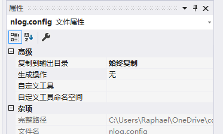
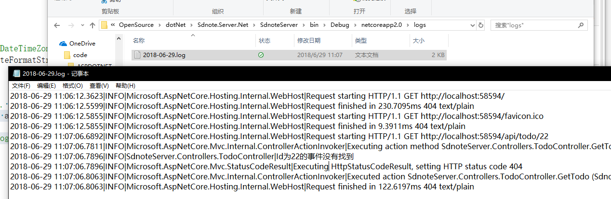

# dotNet Core Web Api

## 常用服务

 - 添加XML 内容协商服务

允许接受 浏览器/Request 请求头 Accept 为 Application/xml 并返还 XML 格式数据
```cs
//添加XML 内容协商服务
        options.OutputFormatters.Add(new XmlDataContractSerializerOutputFormatter());
```

 - 时间格式
设置服务时间格式为 UTC 时区格式/yyyy-MM-dd HH:mm:ss 
```cs
.AddJsonOptions(options =>
    {
        //Set date configurations
        //options.SerializerSettings.DateTimeZoneHandling = DateTimeZoneHandling.Utc;
        options.SerializerSettings.DateFormatString = "yyyy-MM-dd HH:mm:ss";
    });
```

## 创建并返回201
```cs
[Route("{id}", Name ="GetTodo")]
public IActionResult GetTodo(int id)
{
    var todo = TodoService.Current.Todos.SingleOrDefault(x => x.Id == id);
    if (todo == null)
    {
        return NotFound();
    }

    return Ok(todo);
}

//POST 添加todo
[HttpPost]
public IActionResult Post([FromBody] TodoCreation todo)
{
    if (todo == null)
    {
        return BadRequest();
    }

    var maxId = TodoService.Current.Todos.Max(x => x.Id);
    var newTodo = new Todo
    {
        Id = ++maxId, //ID 顺位加一
        TdName = todo.TdName,
        TdTime = todo.TdTime
    };

    TodoService.Current.Todos.Add(newTodo);

    return CreatedAtRoute("GetTodo",new {id = newTodo.Id}, newTodo);
    //return new JsonResult(todo);
}
```
如上所示，HttpPost 请求 并放回一个 `CreateAtRoute`方法，带三个字段，"Route Name","参数","对象结果"。

## Data Annotations 验证特性


## Nlog 配置使用
注入Logger 并记录log
```cs
//注入logger
private ILogger<TodoController> _logger;

public TodoController(ILogger<TodoController> logger)
{
    _logger = logger;
}

//使用
 _logger.LogInformation($"Id为{id}的事件没有找到");
```

nuget 安装 Nlog ，勾选预发行版，搜索`NLog.Extensions.Logging`
```xml
<?xml version="1.0" encoding="utf-8" ?>
<nlog xmlns="http://www.nlog-project.org/schemas/NLog.xsd"
      xmlns:xsi="http://www.w3.org/2001/XMLSchema-instance">
  <targets>
    <target name="logfile" xsi:type="File" fileName="logs/${shortdate}.log" />

  </targets>
  <rules>
    <logger name="*" minlevel="Info" writeTo="logfile" />
  </rules>
</nlog>
```

配置 Nlog.config 的属性




在`startup.cs`中配置
```cs
 public void Configure(IApplicationBuilder app, IHostingEnvironment env, ILoggerFactory loggerFactory)
{
    //loggerFactory.AddProvider(new NLogLoggerProvider());
    loggerFactory.AddNLog();
    ……

```

运行，自动新建一个log文件，记录log信息



- [更多信息-查看github手册](https://github.com/NLog/NLog.Extensions.Logging/blob/master/README.md#how-to-use)